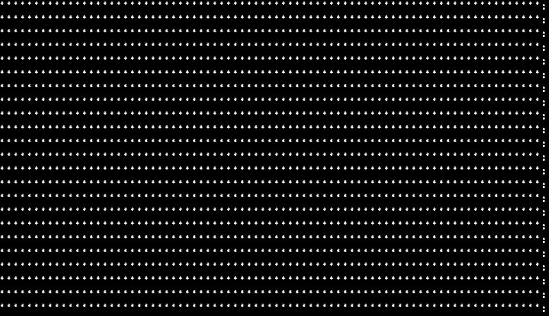
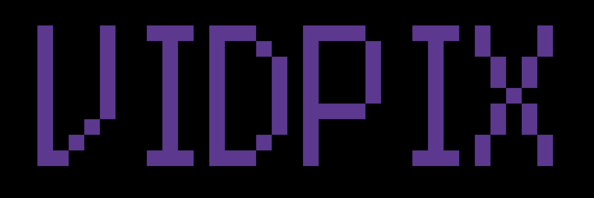

# VIDPIX

Превращает любое видео в ASCII-анимацию — MP4 или GIF, прямо в терминале.

VIDPIX — это один портативный бинарник, который конвертирует видеофайл в стилизованную анимацию, целиком состоящую из символов вроде 0 1 : ; *. Положите его рядом с видео, запустите, ответьте на пару вопросов — и получите готовый к публикации .mp4 или .gif за секунды. Без установщиков, без Python, без настройки ffmpeg. Просто один файл.

[English version](README.md) · [Changelog](CHANGELOG.md)

## Возможности

- Один бинарник, три платформы — Windows, Linux, macOS (Intel + Apple Silicon)
- Портативность — работает из любой папки, ищет видео рядом с собой
- Полностью оффлайн после первого запуска — ffmpeg скачивается один раз
- Два формата вывода — MP4 (H.264) и GIF (оптимизированная палитра)
- Четыре набора символов — 0 1, : ; 0 1, *, или всё вместе
- Двуязычный интерфейс — русский и английский из коробки
- Собственный рендер шрифта — чёткие ASCII-кадры со встроенным шрифтом
- Никаких зависимостей на машине пользователя

## Быстрый старт

### 1. Скачайте

Возьмите архив для своей ОС из [последнего релиза](https://github.com/datekt/vidpix/releases):

| Платформа | Файл |
|---|---|
| Windows (x64) | vidpix-windows-x86_64.zip |
| Linux (x64) | vidpix-linux-x86_64.tar.gz |
| macOS (Intel) | vidpix-macos-x86_64.tar.gz |
| macOS (Apple Silicon) | vidpix-macos-arm64.tar.gz |

### 2. Положите рядом с видео

    MyVideos/
      vidpix.exe
      clip.mp4
      concert.mov

### 3. Запустите

    vidpix

### 4. Ответьте на вопросы меню

    Language? / Язык?
    > Русский
      English
      Cancel / Отмена

    Привет! Какое видео конвентируем?
    > clip.mp4
      concert.mov
      Отмена

    Отличный выбор! Из каких символов хотите анимацию?
    > 0 и 1
      : ; 0 1
      *
      Все вместе (0 1 : ; *)
      Отмена

    В каком формате сохранить?
    > MP4 (видео)
      GIF (анимация)
      Отмена

### 5. Заберите результат

    clip_vidpix.mp4

Всё.

## Поддерживаемые форматы входа

| Контейнер | Расширение |
|---|---|
| MPEG-4 | .mp4, .m4v |
| QuickTime | .mov |
| Matroska | .mkv |
| WebM | .webm |
| AVI | .avi |
| Flash Video | .flv |
| Windows Media | .wmv |

Любой кодек, который умеет декодировать ffmpeg, подойдёт.

## Команды

    vidpix              запуск интерактивного меню
    vidpix --help       показать справку
    vidpix --version    показать версию

Интерактивное меню — основной путь. Запоминать нечего.

## Как это работает

1. ffmpeg извлекает кадры, масштабирует их до 80 колонок и переводит в оттенки серого
2. Яркость каждого пикселя превращается в символ из выбранного набора
3. Каждый ASCII-кадр рендерится в PNG-картинку с помощью встроенного шрифта
4. ffmpeg собирает последовательность PNG в H.264 MP4 или оптимизированный GIF

Каждый этап выполняется локально. Никаких загрузок, телеметрии и облаков.

## Требования

- Windows 10+, Linux (glibc 2.31+) или macOS 10.15+
- Около 5 МБ под сам бинарник
- Около 80 МБ свободного места под ffmpeg (скачивается автоматически при первом запуске)
- Интернет только при первом запуске — дальше всё работает полностью оффлайн

## Сборка из исходников

Требуется Rust 1.75+.

    git clone https://github.com/datekt/vidpix.git
    cd vidpix
    cargo build --release

Бинарник появится в target/release/vidpix (или vidpix.exe на Windows).

Запустить тесты:

    cargo test

## Структура проекта

    src/
      core/          декодирование видео, ASCII-конвертация, рендер, кодирование
      i18n/          локализованные строки (EN / RU)
      ui/            интерактивное меню и прогресс-бары
      utils/         вспомогательные функции для путей
      args.rs        разбор флагов командной строки
      cli.rs         верхнеуровневый поток выполнения
      main.rs        точка входа

## Участие в разработке

Pull request'ы приветствуются. Для крупных изменений сначала откройте issue и обсудите, что хотите поменять.

1. Форкните репозиторий
2. Создайте ветку: git checkout -b feature/amazing-thing
3. Закоммитьте изменения
4. Запушьте ветку
5. Откройте Pull Request

## Лицензия

Распространяется под лицензией MIT. Подробности в файле LICENSE.

## Благодарности

- FFmpeg — фундамент каждого этапа
- ffmpeg-sidecar — незаметная доставка ffmpeg
- image + imageproc — рендер кадров
- ab_glyph — растеризация шрифта
- dialoguer + indicatif — терминальный UX

Сделано на Rust с 🦀 [datekt](https://github.com/datekt)